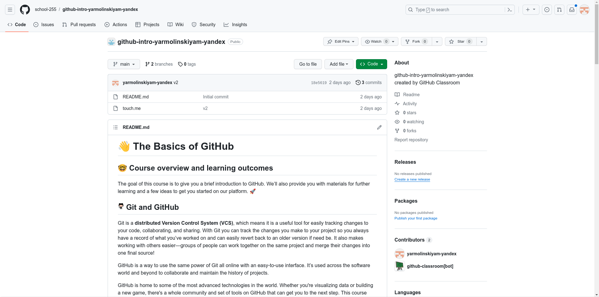

# Основы GitHub

## Где я?

Ты находишься в автоматически добавленом в твой аккаунт репозитории с заданием. Главная страница репозитория выглядит примерно так (с точностью до текста и цветовой темы):



В данный момент из интересного в репозитории - два файла:
1. `README.md` - файл, который ты сейчас читаешь. В нем написана общая информация о GitHub, Markdown, а также **ЗАДАНИЕ**, которое надо выполнить;
2. `HOWTO.md` - файл с инструкциями по работе с GitHub и Codespaces (на какие кнопки жать и в каком порядке).

А сейчас перед тобой краткое введение в GitHub. Здесь ты узнаешь самое главное что тебе потребуется для выполнения дальнейшей работы в классе.

## Git и GitHub

Git - это распределенная система контроля версий (VCS), что делает его полезным инструментом для легкого отслеживания изменений в коде, совместной работы и обмена им. С Git ты можешь отслеживать изменения, которые вносишь в свой проект, поэтому у тебя всегда есть запись того, над чем ты работал, и есть возможность легко вернуться к более ранней версии, если это необходимо. Это также облегчает работу с другими - группы людей могут работать вместе над одним проектом и объединять свои изменения в один итоговый источник!

GitHub - это способ использовать ту же мощь Git онлайн с простым в использовании интерфейсом. Он используется во всем мире программного обеспечения и не только для совместной работы и поддержания истории проектов.

GitHub - дом для некоторых из самых продвинутых технологий в мире. Будь то визуализация данных или создание новой игры, на GitHub есть целая сообщество и набор инструментов, которые помогут перейти к следующему шагу. Этот курс начинается с основ GitHub, но мы погрузимся в остальное позже.

## Разбираемся в рабочем процессе на GitHub

GitHub предоставляет много инструментов, которые упрощают взаимодействие с кодом в одиночку и в команде. Рассмотрим как это происходит.

### Репозиторий

Репозиторий - это место, где происходит работа над твоим проектом - думай о нем как об обычной папке. Он содержит все файлы и историю изменений. Ты можешь работать в репозитории самостоятельно или приглашать других к совместной работе над этими файлами.

### Клонирование

Когда репозиторий создается с помощью GitHub, он удаленно хранится в облаке. Ты можешь клонировать репозиторий, чтобы создать локальную копию на своем компьютере, а затем использовать Git для их синхронизации. Это упрощает устранение неполадок, добавление или удаление файлов и выполнение более крупных коммитов. Ты также можешь использовать 
любой инструмент для работы с кодом, не только пользовательский интерфейс GitHub. Клонирование репозитория также локально копирует все данные репозитория, которые есть на GitHub на данный момент времени, включая все версии каждого файла и папки в проекта! Это может быть полезно, если внезапно придется откатить некоторые изменения после неудачных экспериментов. Чтобы узнать больше о клонировании, прочтитай раздел ["Cloning a Repository"](https://docs.github.com/en/github/creating-cloning-and-archiving-repositories/cloning-a-repository).

### Создание коммитов и пуш изменений

**Коммит** (commit) и **пуш** (push) - это способы добавления изменений, внесенных вами на вашем локальном компьютере, в удаленный репозиторий на GitHub. Таким образом, твой учитель и/или товарищи по команде смогут увидеть последние изменения, когда ты готов ими поделиться. Ты можешь совершить коммит для создания "чекпоинта", к которому если что можно будет вернуться в любой момент. Также каждый коммит позволяет добавить краткое сообщение о сущности изменений, чтобы напомнить себе или своим товарищам по команде, какую работу ты сделал (например, “Добавил README с информацией о нашем проекте”).

Все сделанные коммиты хранятся на локальной машине. Если ты хочешь поделится сделанным коммитом/коммитами - ты можешь использовать команду push (запушить) эти изменения в удаленный репозиторий.

Сначала это может показаться непривычным и неудобным, однако, уверен, вскоре ты к этому привыкнешь!

## Немного о Markdown

Как и многое на гитхабе, документ который ты читаешь написан не в MS Word или Google Docs, а в обычном текстовом редакторе с использованием языка разметки Markdown. Что же такое Markdown?

Markdown - это облегченный язык разметки, созданный для обозначения форматирования в простом тексте, с максимальным сохранением его читаемости человеком, и пригодный для машинного преобразования в языки для дальнейшей публикации, такие как HTML, Rich Text и другие.

Создатели Markdown, Джон Грубер и Аарон Шварц, стремились к быстрому форматированию статей. Они хотели, чтобы исходный текст материала оставался читаемым даже без преобразования в веб-страницу.

Markdown поддерживает следующие элементы разметки:

- #### Заголовки:
Заголовки создаются с помощью символа "#", где количество символов "#" определяет уровень заголовка. Например, "# Заголовок 1" будет заголовком первого уровня, а "## Заголовок 2" - заголовком второго уровня 3.

- Списки: 
    1. Списки создаются с помощью символов "*", "-" или "+".
    2. Для создания вложенных списков используются отступы.
    3. Как здесь.

- **Выделение текста**: Текст можно выделить _курсивом_, **жирным** или ~~зачеркнутым~~. Для этого используются символы "*", "_" или "~~".

- > Цитаты: Цитаты создаются с помощью символа ">" перед текстом цитаты.

- Код: Код в Markdown может быть внутри строки (inline) либо многострочными блоками. `Внутри строки код выделяется символом:` "`" (обратный апостроф).
```python
print("Многострочный блок кода обозначается тремя апострофами"...
    " или отбивкой четырьмя пробелами или табом"...
    " с возможностью указания языка для корректной подстветки синтаксиса")
```

- Ссылки и изображения: Ссылки и изображения в Markdown создаются с помощью специального синтаксиса. Например, ссылка создается в виде [текст ссылки](URL ссылки), а изображение - в виде .


- Таблицы: В некоторых диалектах Markdown, таких как GitHub Flavored Markdown, есть возможность создавать таблицы. Столбцы разделяются вертикальными линиями "|", а строка с шапкой отделяется от остальных дефисами "-".

```
| Например | Вот      | Так      |
|----------|----------|----------|
| Row 1    | Cell 2   | Cell 3   |
| Row 2    | Cell 5   | Cell 6   |
| Row 3    | Cell 8   | Cell 9   |
```

| Например | Вот      | Так      |
|----------|----------|----------|
| Row 1    | Cell 2   | Cell 3   |
| Row 2    | Cell 5   | Cell 6   |
| Row 3    | Cell 8   | Cell 9   |

### И где этот Markdown нужен?

Markdown широко используется в программировании для написания документации, блогов и других текстовых материалов. Он поддерживается многими системами контроля версий, включая Git, и многими системами управления контентом, включая WordPress и GitHub 5.

Одно из главных преимуществ этого формата относительно RichText форматов `.doc/.docx/.odt` является то, что файл `.md` - это обычный текстовый файл, который можно открыть и редактировать в любом блокноте. Он имеет очень маленький размер файла, легко читаем и много где используется. А самое главное - он позволяет сосредоточится на наборе текста без отвлеканий на полетевшие шрифты и поехавшее форматирование.

## Что же мне делать сейчас?

В качестве первого задания тебе необходимо создать новый текстовый файл в формате Markdown с названием: `<Твоя фамилия>.md`. **ВАЖНО:** название файла не должно содержать кириллицу _(это не техническое ограничение, а требование задания. Однако при работе с кодом и специализированным ПО все же рекомендуется избегать символов, не входящих в основную таблицу ASCII ввиду возможных проблем с совместимостью)_. Написать туда заголовком первого уровня "Знакомство с Markdown и GitHub", после чего обычным текстом написать свои имя, фамилию и класс. После чего написать один-два абзаца о каком-нибудь событии, явлении, факте, алгоритме, методе (можно взять из сочинения, с википедии, откуда угодно), применив методы форматирования текста, а именно:

- заголовки второго и третьего уровней,
- список (либо нумерованный, либо ненумерованный),
- выделение текста (курсив, жирный и зачеркнутый),
- цитату,
- код (либо встроенный, либо многострочный),
- изображение.

Инструкцию по выполнению первого задания можно прочитать в файле по соседству с названием `HOWTO.md`
